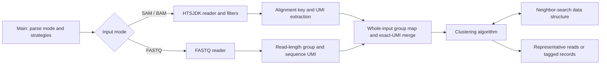
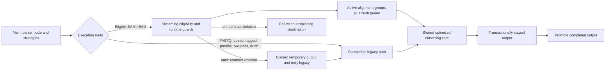

# Architecture

This document describes the canonical upstream UMICollapse architecture at
commit [`efeab35`](https://github.com/Daniel-Liu-c0deb0t/UMICollapse/commit/efeab35f5d29dec1d496ade3f681eeb34d9c2057)
and the architecture of this fork. The fork preserves UMICollapse's command-line
model and clustering semantics while changing how compatible SAM/BAM workloads
are retained and processed.

The diagram sources are also available as
[`upstream-architecture.mmd`](diagrams/upstream-architecture.mmd) and
[`resulting-architecture.mmd`](diagrams/resulting-architecture.mmd).

## Upstream architecture



### Strategy selection

[`Main.java`](../src/umicollapse/main/Main.java) selects three independent
strategies:

- a clustering algorithm: directional, adjacency, or connected components;
- a neighbor-search data structure, with `NgramBKTree` as the default;
- a representative-selection policy: mapping quality, average base quality, or
  any read.

The default SAM/BAM combination is directional clustering, `NgramBKTree`, and
mapping-quality selection. These are runtime choices rather than separate
pipelines.

### SAM/BAM ingestion

The default upstream path reads the input through HTSJDK, filters records, and
constructs an alignment key. For single-end records, that key contains:

- reference name;
- strand;
- unclipped start for a positive-strand record, or unclipped end for a
  negative-strand record.

Paired mode adds inferred template length and processes the forward record as
the deduplication representative for the pair.

Every retained record is parsed for its UMI and accumulated in a nested map:

```text
Alignment -> UMI -> representative read + observed count
```

Reads with an identical UMI at an identical alignment key are merged first.
The configured merge policy selects one existing read as the representative;
it does not construct a base-level consensus sequence.

The default path retains this map until the input has been read. It then
clusters each alignment group and writes one representative per resulting UMI
cluster. `--tag` retains the group state and rereads the input to write cluster
annotations.

### Clustering core

The directional algorithm sorts UMIs by observed frequency. It repeatedly
selects a remaining UMI and removes eligible nearby UMIs according to edit
distance and the configured frequency threshold.

`NgramBKTree` divides a UMI into `k + 1` intervals and uses an n-gram match to
identify candidate BK-trees. The BK-tree then applies exact distance and
frequency checks. Adjacency and connected-components algorithms use the same
data-structure interface with different traversal rules.

### Alternative upstream paths

- `--two-pass` first records the last input position for every alignment key.
  A second read of the input accumulates and releases a group when its last
  occurrence is reached. It trades additional I/O for a smaller retained UMI
  payload, while still retaining the alignment-key index.
- FASTQ mode groups the input by read length and uses each read sequence as the
  UMI-like clustering value.
- Parallel modes replace either the per-alignment traversal or the
  within-alignment data structure with their parallel variants.
- Paired output locates and writes the retained representative's reverse mate
  from an indexed alignment file.

## Resulting dUMI architecture



### Guarded streaming route

Streaming is eligible only when all of the following are true:

- the input is SAM or BAM and declares coordinate sort order;
- processing is single-end and sequential;
- cluster tagging is disabled;
- the selected algorithm and data structure use their sequential interfaces;
- `--two-pass` is not selected.

`auto` is this fork's default. `off` always selects the legacy path, while `on`
requires the streaming contract and reports an error when it cannot be
satisfied.

The streaming route still groups records by the same alignment key and performs
the same exact-UMI merge and error-aware clustering. Instead of retaining every
group until end of input, it maintains:

- a map of active alignment groups;
- a priority queue ordered by the earliest coordinate at which each group can
  be flushed safely.

Positive-strand keys use unclipped starts, which can precede coordinate-sort
starts because of leading clipping. The default guard permits at most 10,000
leading clipped bases. Negative-strand keys use unclipped ends and do not need
the same leading-clipping allowance. Reference transitions flush all remaining
groups for the completed reference.

This produces a coordinate-window-bounded working set: retained state depends
on the number and density of alignment groups and UMIs inside the active
window, rather than on the total input size. It is not a constant-memory
guarantee.

### Runtime and output safety

The streaming reader verifies actual reference and alignment-start monotonicity
instead of trusting only the header. It also checks every positive-strand
record against the clipping window before flushing a group that the record
could still join.

Every advertised CLI route writes to a same-directory staged output. The
completed file is promoted to the requested destination only after input
processing and writer closure succeed. This protects an existing destination
from malformed input and late failures in FASTQ, legacy, paired, tagged,
two-pass, and streaming runs.

Streaming adds an inner temporary-output boundary around its fallback attempt.
In `auto` mode, an order or clipping violation deletes that attempt and
restarts with the legacy path while retaining the outer CLI transaction. In
forced `on` mode, the run fails without replacing an existing destination.

Groups can be emitted outside coordinate order, so streaming output is declared
`SO:unsorted`. Legacy, paired, tagged, and two-pass routes retain their HTSJDK
sort behavior.

### Shared optimized core

Both streaming and compatible legacy routes use the same optimized components:

- the default underscore-delimited UMI is scanned directly from the read name
  and encoded without substring and uppercase allocations;
- average base quality is calculated only when the selected merge policy
  requests it;
- exact-UMI maps avoid redundant lookups;
- deterministic tie policies stabilize representative selection and
  algorithm traversal, except for the explicitly arbitrary `any` merge policy;
- streaming bypasses general clustering setup for singleton UMI groups while
  the public directional API retains its semantics-preserving singleton path;
- component traversal uses explicit work queues instead of component-sized
  recursion;
- representable n-gram intervals use packed 64-bit keys and an open-addressed
  map sized against the reachable n-gram key space, with the original
  object-key representation retained as a fallback.

Paired mode keeps one reader open for mate recovery instead of reopening the
BAM at each reference transition. Indexed inputs use reference queries;
SAM and unindexed BAM inputs use sequential recovery without requiring an
index.

The CLI validates option names, values, ranges, strategy compatibility, UMI
lengths, and input/output identity before opening the output transaction.
Custom UMI separators are literal strings.

## Build and verification architecture

Production sources live under `src/umicollapse/`. The build:

1. verifies checksum-locked HTSJDK and snappy-java dependencies;
2. compiles Java 11-compatible production and test classes separately with
   warnings treated as errors;
3. packages only production classes with normalized timestamps and
   deterministic entry order;
4. embeds a receipt covering production sources, build scripts, manifest,
   dependency lock, compiler, archiver, Git commit, version, and timestamp;
5. verifies consecutive JARs byte for byte; and
6. assembles tagged source-and-binary archives with exact runtime
   dependencies, third-party notices, checksums, an SPDX SBOM, and a separate
   build receipt.

[`scripts/check.sh`](../scripts/check.sh) rebuilds and verifies the artifact,
runs unit and differential data-structure tests, and exercises the streaming
compatibility and failure-safety matrix. CI repeats those gates on Java 11 and
21 and checks byte-for-byte reproducibility before the tag-triggered release
workflow publishes assets and requests build-provenance attestations. See
[`VALIDATION.md`](../VALIDATION.md) for the latest acceptance record and
[`PERFORMANCE.md`](PERFORMANCE.md) for benchmark methodology and results.
